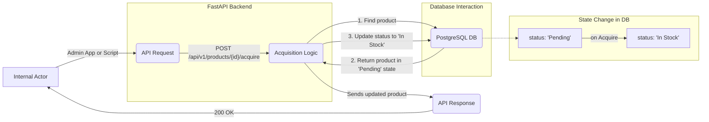

Of course. Now that the user can accept an offer, the next logical step is for the company to process that acceptance and bring the device into its inventory. This is a crucial internal step that prepares items for resale.

Here is the professional implementation plan for Feature 4.

---

### **Feature 4 — Company Acquisition & Inventory Management**

### 1. Goal

To create a secure, internal-facing API endpoint that allows the company to finalize the acquisition of a device from a seller. This action transitions the product's status from "Pending" to "In Stock", officially adding it to the company's sellable inventory and completing the procurement phase of the product lifecycle.

### 2. Deliverables

*   `backend/app/api/products.py`: **Updated** with a new endpoint (`/{product_id}/acquire`).
*   `docs/feature-04-inventory-acquisition.md`: This implementation plan.
*   `README.md`: **Updated** with a new "Internal Acquisition Flow" section.

---

### 3. Scope

#### In

*   **API Endpoint:** A new `POST /api/v1/products/{product_id}/acquire` endpoint, intended for internal company use (e.g., by an admin panel or a warehouse script).
*   **Backend Logic:**
    *   Functionality to update a product's status from "Pending" to "In Stock".
    *   Strict state validation to ensure only products in the "Pending" state can be acquired.
*   **Data Integrity:** The transaction is atomic; the status update is a single, committable change in the database.

#### Out

*   **Internal UI:** This feature only covers the creation of the API endpoint. The user interface for the internal team (e.g., an admin dashboard) is not in scope.
*   **Financial Transactions:** The actual payment to the seller is an external process not handled by this endpoint.
*   **Notification System:** The mechanism for notifying the company that a device is "Pending" (e.g., via email or Slack) is a separate concern and not included here.
*   **Physical Logistics:** Warehouse location, SKU generation, and other complex inventory management details are out of scope.

---

### 4. Architecture

This feature extends the existing REST API with a new endpoint designed for an internal actor. This actor (which could be an admin, a script, or a future internal application) authenticates and communicates with the FastAPI backend to trigger a state change in the database. The architecture remains simple and robust, isolating internal operations from the public-facing user application.



---

### 5. Schema Definition

#### Input Schema (API Request)

No new request body schemas are required. The `product_id` is the only input, passed as a URL path parameter.

#### Output Schema (API Response)

The endpoint will return the fully updated product object using the existing `ProductResponse` schema to confirm the successful state transition.

| column | type | notes |
| --- | --- | --- |
| `status` | str | **Will now be "In Stock"** |
| ... | ... | All other existing product fields |

---

### 6. Implementation Details / Technical Approach

*   **Backend (`backend/app/api/products.py`):**
    *   Create a new `router.post` endpoint that uses a path parameter for the `product_id`.
    *   **Acquire Endpoint (`@router.post("/{product_id}/acquire", response_model=schemas.ProductResponse)`):**
        1.  The function will accept `product_id: int` and the `db: Session = Depends(get_db)` dependency.
        2.  Fetch the product record from the database using the provided `product_id`. If it's not found, raise a `404 Not Found` `HTTPException`.
        3.  **State Validation:** Implement a crucial check: `if db_product.status != "Pending":`. If this condition is true, raise a `400 Bad Request` `HTTPException` with a clear error message, such as "Product is not in a pending state and cannot be acquired."
        4.  Update the status field: `db_product.status = "In Stock"`.
        5.  Commit the transaction to the database: `db.commit()`.
        6.  Refresh the object to get the updated state from the DB: `db.refresh(db_product)`.
        7.  Return the updated `db_product` object.
*   **Frontend:**
    *   No changes are required for the public-facing React application.

---

### 7. Error Handling & Edge Cases

*   **Invalid Product ID:** The endpoint returns a `404 Not Found` if an incorrect ID is provided, preventing errors on non-existent records.
*   **Incorrect State:** The endpoint is idempotent in effect for invalid states. Trying to acquire a "Registered", "Closed", or already "In Stock" product will result in a `400 Bad Request` and will not change the database, ensuring process integrity.

---

### 8. Definition of Done

*   [ ] A new API endpoint, `/acquire`, is implemented and functional in `backend/app/api/products.py`.
*   [ ] The endpoint correctly validates that the product's current status is "Pending" before proceeding.
*   [ ] The product status in the PostgreSQL database is correctly updated to "In Stock" upon a successful request.
*   [ ] `README.md` is updated to document the new internal API endpoint.
*   [ ] A PR is opened from `feature/4-inventory-acquisition` to `main`.

---

### 9. File Manifest

Files created or modified in this feature:

```
backend/app/api/products.py         # MODIFIED
docs/feature-04-inventory-acquisition.md # CREATED
README.md                           # MODIFIED
```

---

### 10. Conventional Commits

*   `feat(api): create endpoint to acquire products into inventory`
*   `refactor(api): add state validation to acquisition endpoint`
*   `docs(readme): add internal acquisition flow section`

---

### 11. Pull Request Template

**Title:** `feat: implement internal endpoint for product acquisition`

**Summary:**
This PR introduces a new internal-facing API endpoint (`POST /api/v1/products/{product_id}/acquire`) to manage the final step of the product procurement process.

This endpoint allows an authorized internal system to mark a "Pending" device as "In Stock" after it has been physically received and inspected. It includes strict state validation to ensure that only products in the correct "Pending" state can be transitioned into inventory. This completes the acquisition lifecycle and prepares the product for the resale and dynamic valuation phase.

**Checklist:**
*   [ ] Backend endpoint `/acquire` is implemented.
*   [ ] State validation logic is in place.
*   [ ] Database status is correctly updated to "In Stock".
*   [ ] `README.md` has been updated to document the new endpoint.