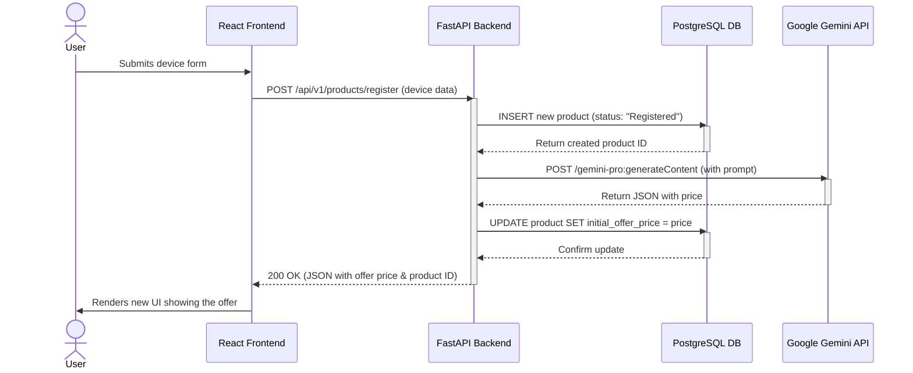

### **Feature 2 — Value Assessment & Offer Generation (Gemini)**

### 1. Goal

Integrate the Google Gemini API to provide real-time, AI-powered valuation for a submitted device. The backend service will act as a secure orchestrator, managing the external API call and persisting the generated offer to the database, which is then returned to the frontend for the user.

### 2. Deliverables

*   `backend/requirements.txt`: **Updated** with the `google-generativeai` library.
*   `backend/.env`: A **new**, git-ignored file to securely store the API key.
*   `docker-compose.yml`: **Updated** to inject the `.env` file into the backend service.
*   `backend/app/api/products.py`: **Updated** to include the Gemini API call logic within the registration endpoint.
*   `frontend/src/components/ProductSubmissionForm.tsx`: **Updated** to handle the new loading and offer-display states.
*   `docs/feature-02-gemini-valuation.md`: This implementation plan.
*   `README.md`: **Updated** with a new "AI Valuation Layer" section.

---

### 3. Scope

#### In

*   **API Key Management:** Securely storing the Google API key in an environment file (`.env`) that is excluded from version control.
*   **Backend Logic:**
    *   Updating the `POST /api/v1/products/register` endpoint.
    *   The endpoint will now perform a multi-step process: create the initial product record, craft a prompt, call the Gemini API, parse the JSON response, and update the product record with the offer price.
*   **External API Integration:** Using the `google-generativeai` Python library to communicate with the Gemini Pro model.
*   **Frontend State Management:**
    *   Implementing a loading state in the React UI while waiting for the API response.
    *   Implementing an offer-display state to show the price once it's received.
    *   Implementing a basic error state to inform the user if the valuation fails.

#### Out

*   Detailed parsing of the "reasoning" from the LLM (we will only use the "price" for now).
*   Complex retry logic for failed API calls.
*   Saving the full raw response from the LLM to the database.
*   User-facing actions on the offer (Accept/Decline will be handled in Feature 3).

---

### 4. Architecture

The architecture introduces a critical external dependency: the **Google Gemini API**. Our FastAPI backend's role expands from simple data persistence to that of a service orchestrator. It ensures the API key remains secure on the server-side and translates the simple device data into a complex external API call.



---

### 5. Schema Definition

#### Input Schema (`backend/.env`)

| variable | type | notes |
| --- | --- | --- |
| `GOOGLE_API_KEY` | str | Your secret API key from Google AI Studio. |

#### Output Schema (API Response)

The `POST /api/v1/products/register` endpoint will now return the `ProductResponse` schema with the `initial_offer_price` field populated.

| column | type | notes |
| --- | --- | --- |
| `id` | int | Primary Key |
| `device_model`| str | e.g., "iPhone 14 Pro" |
| `status` | str | "Registered" |
| `initial_offer_price` | float | **The price generated by the Gemini API** |
| ... | ... | Other existing product fields |

---

### 6. Implementation Details / Technical Approach

*   **Environment Setup:**
    *   Create `backend/.env` and add `GOOGLE_API_KEY="your-key"`.
    *   Add `backend/.env` to your root `.gitignore` file.
    *   In `docker-compose.yml`, add the `env_file: ['./backend/.env']` directive to the `backend` service.
    *   Add `google-generativeai` to `backend/requirements.txt`.
    *   Run `docker-compose up --build -d` to rebuild the backend service with the new dependency and environment variable.
*   **Backend (`products.py`):**
    *   At the top of the file, configure the Gemini library:
        ```python
        import os
        import google.generativeai as genai
        genai.configure(api_key=os.getenv("GOOGLE_API_KEY"))
        ```
    *   In the `register_product` endpoint, after creating the initial DB record, construct the prompt.
    *   Use a `try...except` block to call the model and handle potential errors (e.g., API failures, invalid JSON from the LLM).
        ```python
        model = genai.GenerativeModel('gemini-pro')
        response = model.generate_content(prompt)
        llm_output = json.loads(response.text)
        offer_price = float(llm_output.get("price", 0.0))
        ```
    *   Update the database record with the `offer_price` before returning the final response.
*   **Frontend (`ProductSubmissionForm.tsx`):**
    *   Introduce `useState` hooks for `isLoading`, `offer`, and `error`.
    *   The `handleSubmit` function should set `isLoading` to `true` at the start and `false` in a `finally` block.
    *   On a successful `fetch`, parse the response and update the `offer` state.
    *   On a failed `fetch`, update the `error` state.
    *   Use conditional rendering in the JSX to show one of three views: the form, the loading indicator, or the offer display.

---

### 7. Error Handling & Edge Cases

*   **Missing API Key:** The backend will fail to start or make API calls if the `GOOGLE_API_KEY` is not set. The `genai.configure` step will likely raise an error.
*   **Invalid LLM Response:** The Gemini API might not return valid JSON. The `json.loads(response.text)` call is a potential failure point and must be wrapped in a `try...except` block to prevent a 500 server error, instead returning a user-friendly error message (e.g., `503 Service Unavailable`).

---

### 8. Definition of Done

*   [ ] The `google-generativeai` library is added to `requirements.txt`.
*   [ ] The `GOOGLE_API_KEY` is securely configured via a `.env` file and Docker Compose.
*   [ ] The `POST /register` endpoint successfully calls the Gemini API and updates the database.
*   [ ] The frontend correctly displays a loading state and then the final price offer upon successful submission.
*   [ ] `README.md` is updated to describe the new AI valuation layer and the required environment setup.
*   [ ] A PR is opened to `main` from `feature/2-gemini-valuation`.

---

### 9. File Manifest

Files created or modified in this feature:

```
backend/requirements.txt                   # MODIFIED
backend/.env                               # CREATED (but not committed)
docker-compose.yml                         # MODIFIED
backend/app/api/products.py                  # MODIFIED
frontend/src/components/ProductSubmissionForm.tsx # MODIFIED
docs/feature-02-gemini-valuation.md        # CREATED
README.md                                  # MODIFIED
.gitignore                                 # MODIFIED
```

---

### 10. Conventional Commits

*   `feat(api): integrate gemini api for product valuation`
*   `feat(frontend): add loading and offer display states`
*   `chore(deps): add google-generativeai library`
*   `ci(docker): configure env file for backend service`
*   `docs(readme): add ai valuation layer and setup instructions`

---

### 11. Pull Request Template

**Title:** `feat: implement gemini-powered price valuation`

**Summary:**
This PR introduces the core AI functionality of the application by integrating the Google Gemini API. The primary backend registration endpoint has been enhanced to perform a multi-step orchestration: it persists the initial device submission, calls the Gemini API to generate a fair market price, updates the database record with this price, and returns the offer to the client.

The frontend has been updated to support this asynchronous flow, providing users with a loading indicator during the valuation process and then displaying the final offer. API key management is handled securely via a `.env` file and Docker Compose.

**Checklist:**
*   [ ] Gemini API is successfully integrated into the backend.
*   [ ] API key is managed securely and is not in version control.
*   [ ] Frontend state management for loading/offer/error is implemented.
*   [ ] `README.md` has been updated with setup instructions.