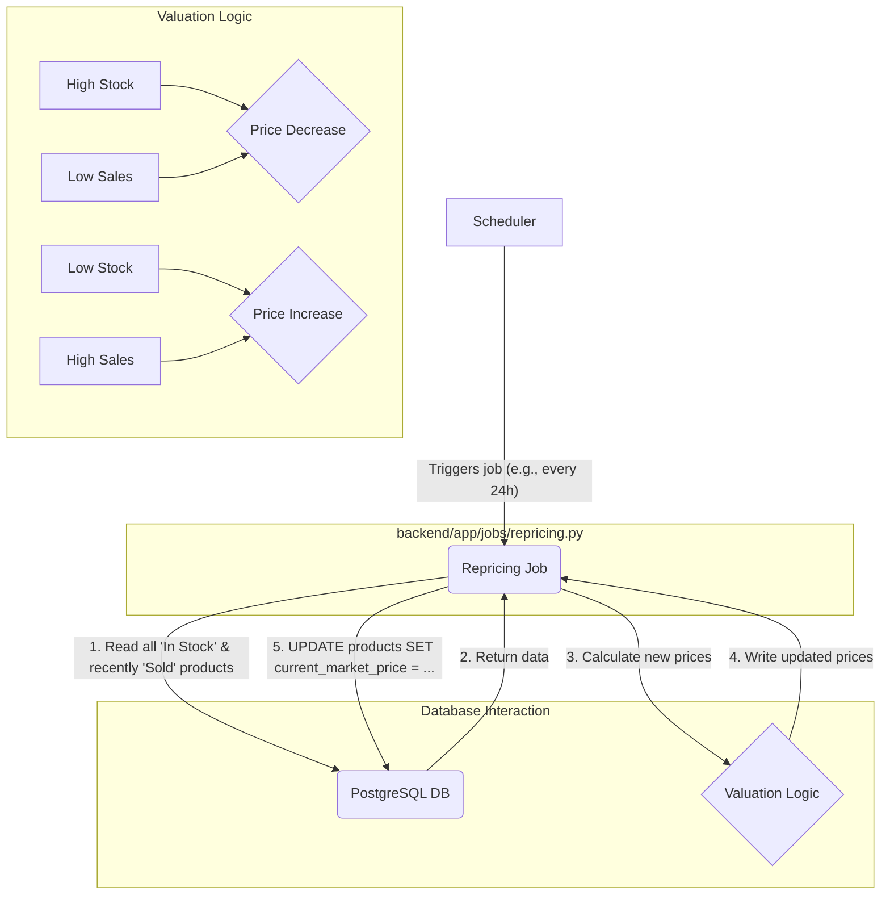

### **Feature 5 — Dynamic Product Valuation**

### 1. Goal

To implement the core business logic that dynamically adjusts the valuation of products in the company's inventory based on real-time market factors. The goal is to create a background job or a scheduled task that reprices "In Stock" items, increasing their value when stock is low and demand is high, and decreasing it when stock is high and demand is low.

### 2. Deliverables

*   `backend/app/jobs/repricing.py`: A **new** Python script containing the dynamic valuation logic.
*   `backend/app/schemas.py`: **Updated** with a new `current_market_price` field in the `Product` schema.
*   `backend/app/models.py`: **Updated** with a new `current_market_price` column in the `Product` table.
*   `docker-compose.yml`: **Updated** to potentially add a scheduler service or cron job.
*   `docs/feature-05-dynamic-valuation.md`: This implementation plan.
*   `README.md`: **Updated** with a new "Dynamic Valuation Engine" section.

---

### 3. Scope

#### In

*   **Valuation Logic:** A Python function that implements the core repricing algorithm. For this feature, the logic will be based on two simple, calculated metrics:
    *   **`stock_level`**: The number of units of a specific `device_model` that are "In Stock".
    *   **`sales_velocity`**: The number of units of that `device_model` sold in the last 30 days.
*   **Database Schema Change:** Adding a new `current_market_price` column to the `products` table to store the dynamically adjusted price. The `final_sale_price` will be used to track the price at which an item actually sold.
*   **Scheduled Execution:** A mechanism to run the repricing job periodically (e.g., once every 24 hours). We will start with a simple, manually triggerable script and note how to automate it.

#### Out

*   **Real-time External Market Data:** This feature will not scrape competitor websites or integrate with external market data APIs. The valuation is based purely on our *internal* stock and sales data.
*   **Complex AI/ML Forecasting:** We will not build a predictive machine learning model for demand forecasting. The logic will be rule-based.
*   **User-Facing Price Updates:** This feature only updates the price in the backend database. A future feature would be required to show these price changes on a public-facing storefront.
*   **A full-fledged scheduler service (like Celery Beat or APScheduler):** For simplicity in this iteration, we'll create a script that can be run via a `cron` job or a simple Docker command, which is a common and robust approach.

---

### 4. Architecture

This feature introduces an asynchronous, non-user-facing component: the **Repricing Job**. This job runs independently of the main FastAPI application. It connects directly to the PostgreSQL database, reads inventory and sales data, calculates new prices, and writes them back to the database. This separation ensures that the potentially long-running valuation process does not block or slow down the user-facing API.



---

### 5. Schema Definition

#### Database & Schema Changes (`models.py` & `schemas.py`)

A new column will be added to the `products` table. The Pydantic schemas will be updated to reflect this.

| column | type | notes |
| --- | --- | --- |
| `current_market_price` | `Float` / `Numeric` | **NEW.** Stores the dynamically adjusted price. Can be initialized to `initial_offer_price`. |
| `sold_at` | `DateTime` | **NEW (Nullable).** Timestamp for when the product status changes to "Sold". Crucial for calculating sales velocity. |

---

### 6. Implementation Details / Technical Approach

*   **Database Migration:**
    1.  Add `current_market_price = Column(Float, nullable=True)` and `sold_at = Column(DateTime, nullable=True)` to your `Product` model in `backend/app/models.py`.
    2.  Add the corresponding fields to your `ProductResponse` Pydantic schema.
    3.  Because this is a schema change, you will need to manage the migration. The simplest way in a development Docker environment is to **delete your Docker volume** for the database (`docker-compose down -v`) and restart (`docker-compose up --build`). The `create_all` command in `main.py` will recreate the database with the new schema. **Warning: This deletes all existing data.**

*   **Create the Repricing Job (`backend/app/jobs/repricing.py`):**
    1.  This is a standalone Python script. It will need to set up its own database session. You can reuse the code from your `database.py` file.
    2.  **Main function `run_repricing_job()`:**
        a.  **Fetch Data:** Query the database to get all products where `status == 'In Stock'` and all products where `status == 'Sold'` within the last 30 days.
        b.  **Group Data:** Use Pandas or Python's `itertools.groupby` to group these products by `device_model`.
        c.  **Loop Through Each Model:** For each unique `device_model`:
            i.   Calculate `stock_level` (count of "In Stock" items).
            ii.  Calculate `sales_velocity` (count of "Sold" items in the last 30 days).
            iii. **Apply Pricing Rules (Example):**
                ```python
                # Define thresholds
                LOW_STOCK_THRESHOLD = 5
                HIGH_VELOCITY_THRESHOLD = 10
                
                price_adjustment_factor = 1.0 # Start with no change

                if stock_level < LOW_STOCK_THRESHOLD and sales_velocity > HIGH_VELOCITY_THRESHOLD:
                    price_adjustment_factor = 1.10 # Increase price by 10%
                elif stock_level > (LOW_STOCK_THRESHOLD * 2):
                    price_adjustment_factor = 0.95 # Decrease price by 5%
                
                # Apply this factor to all 'In Stock' items of this model
                for product in in_stock_products_for_this_model:
                    if product.current_market_price:
                        product.current_market_price *= price_adjustment_factor
                    else: # First time pricing
                        product.current_market_price = product.initial_offer_price
                ```
        d.  **Commit Changes:** After calculating all new prices, commit the session to save all updates to the database.

*   **Running the Job:**
    *   You can run the script manually from inside the running backend container:
        ```bash
        docker-compose exec backend python app/jobs/repricing.py
        ```
    *   For automation, a simple `cron` job on the host machine or within a dedicated container is a standard production approach.

---

### 7. Definition of Done

*   [ ] The `products` table in the database is updated with `current_market_price` and `sold_at` columns.
*   [ ] A new script, `backend/app/jobs/repricing.py`, is created and contains the core valuation logic.
*   [ ] The script correctly reads inventory and sales data, calculates a price adjustment factor, and updates the `current_market_price` for "In Stock" items.
*   [ ] The script can be executed successfully via a `docker-compose exec` command.
*   [ ] `README.md` is updated to explain the dynamic valuation engine and how to run the job.
*   [ ] A PR is opened from `feature/5-dynamic-valuation` to `main`.

---

### 8. File Manifest

```
backend/app/models.py                 # MODIFIED
backend/app/schemas.py                # MODIFIED
backend/app/jobs/repricing.py         # CREATED
docs/feature-05-dynamic-valuation.md  # CREATED
README.md                             # MODIFIED
```

---

### 9. Conventional Commits

*   `feat(db): add market price and sold_at columns to products`
*   `feat(jobs): create initial rule-based dynamic repricing job`
*   `docs(readme): add dynamic valuation engine section`

---

### 10. Pull Request Template

**Title:** `feat: implement dynamic product valuation job`

**Summary:**
This PR introduces the core dynamic pricing engine for the application. It consists of a new standalone Python job (`repricing.py`) that runs independently of the user-facing API.

The job performs the following actions:
1.  Analyzes the current stock level and recent sales velocity for each device model in inventory.
2.  Applies a rule-based algorithm to calculate a price adjustment factor (increasing prices for scarce, high-demand items and decreasing for overstocked, low-demand items).
3.  Updates a new `current_market_price` field in the database for all "In Stock" products.

This feature also includes the necessary database schema migrations to support this new functionality. The job is designed to be run on a schedule, ensuring our product pricing remains competitive and responsive to internal market conditions.